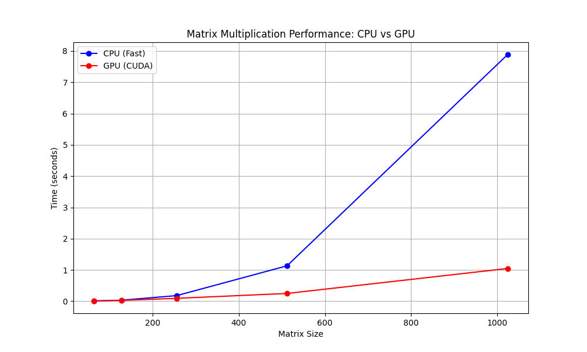

# MiniTorch Module 3


* Docs: https://minitorch.github.io/

* Overview: https://minitorch.github.io/module3.html


You will need to modify `tensor_functions.py` slightly in this assignment.

* Tests:

```
python run_tests.py
```

* Note:

Several of the tests for this assignment will only run if you are on a GPU machine and will not
run on github's test infrastructure. Please follow the instructions to setup up a colab machine
to run these tests.

This assignment requires the following files from the previous assignments. You can get these by running

```bash
python sync_previous_module.py previous-module-dir current-module-dir
```

The files that will be synced are:

        minitorch/tensor_data.py minitorch/tensor_functions.py minitorch/tensor_ops.py minitorch/operators.py minitorch/scalar.py minitorch/scalar_functions.py minitorch/module.py minitorch/autodiff.py minitorch/module.py project/run_manual.py project/run_scalar.py project/run_tensor.py minitorch/operators.py minitorch/module.py minitorch/autodiff.py minitorch/tensor.py minitorch/datasets.py minitorch/testing.py minitorch/optim.py


## Task 3.1: Parallelization

```
MAP

================================================================================
 Parallel Accelerator Optimizing:  Function tensor_map.<locals>._map,
C:\Users\mlock\Desktop\CS 5781 Machine Learning
Engineering\workspace\mod3-CSK0227\minitorch\fast_ops.py (176)
================================================================================


Parallel loop listing for  Function tensor_map.<locals>._map, C:\Users\mlock\Desktop\CS 5781 Machine Learning Engineering\workspace\mod3-CSK0227\minitorch\fast_ops.py (176)
-----------------------------------------------------------------------------|loop #ID
    def _map(                                                                |
        out: Storage,                                                        |
        out_shape: Shape,                                                    |
        out_strides: Strides,                                                |
        in_storage: Storage,                                                 |
        in_shape: Shape,                                                     |
        in_strides: Strides,                                                 |
    ) -> None:                                                               |
        ## TODO: Implement for Task 3.1.                                     |
        #raise NotImplementedError("Need to implement for Task 3.1")         |
                                                                             |
        if np.array_equal(in_strides, out_strides) and np.array_equal(       |
            in_shape, out_shape                                              |
        ):                                                                   |
            for i in prange(len(out)):---------------------------------------| #0
                out[i] = fn(in_storage[i])                                   |
        #Map s                                                               |
        else :                                                               |
            for i in prange(len(out)):---------------------------------------| #1
                # Create thread-local indices inside the parallel loop       |
                out_index = np.empty(MAX_DIMS, np.int32)                     |
                in_index = np.empty(MAX_DIMS, np.int32)                      |
                                                                             |
                to_index(i, out_shape, out_index)                            |
                broadcast_index(out_index, out_shape, in_shape, in_index)    |
                o = index_to_position(out_index, out_strides)                |
                j = index_to_position(in_index, in_strides)                  |
                out[o] = fn(in_storage[j])                                   |
--------------------------------- Fusing loops ---------------------------------
Attempting fusion of parallel loops (combines loops with similar properties)...
Following the attempted fusion of parallel for-loops there are 2 parallel for-
loop(s) (originating from loops labelled: #0, #1).
--------------------------------------------------------------------------------
----------------------------- Before Optimisation ------------------------------
--------------------------------------------------------------------------------
------------------------------ After Optimisation ------------------------------
Parallel structure is already optimal.
--------------------------------------------------------------------------------
--------------------------------------------------------------------------------

---------------------------Loop invariant code motion---------------------------
Allocation hoisting:
The memory allocation derived from the instruction at C:\Users\mlock\Desktop\CS
5781 Machine Learning Engineering\workspace\mod3-CSK0227\minitorch\fast_ops.py
(196) is hoisted out of the parallel loop labelled #1 (it will be performed
before the loop is executed and reused inside the loop):
   Allocation:: out_index = np.empty(MAX_DIMS, np.int32)
    - numpy.empty() is used for the allocation.
The memory allocation derived from the instruction at C:\Users\mlock\Desktop\CS
5781 Machine Learning Engineering\workspace\mod3-CSK0227\minitorch\fast_ops.py
(197) is hoisted out of the parallel loop labelled #1 (it will be performed
before the loop is executed and reused inside the loop):
   Allocation:: in_index = np.empty(MAX_DIMS, np.int32)
    - numpy.empty() is used for the allocation.
None
ZIP

================================================================================
 Parallel Accelerator Optimizing:  Function tensor_zip.<locals>._zip,
C:\Users\mlock\Desktop\CS 5781 Machine Learning
Engineering\workspace\mod3-CSK0227\minitorch\fast_ops.py (231)
================================================================================


Parallel loop listing for  Function tensor_zip.<locals>._zip, C:\Users\mlock\Desktop\CS 5781 Machine Learning Engineering\workspace\mod3-CSK0227\minitorch\fast_ops.py (231)
---------------------------------------------------------------------------|loop #ID
    def _zip(                                                              |
        out: Storage,                                                      |
        out_shape: Shape,                                                  |
        out_strides: Strides,                                              |
        a_storage: Storage,                                                |
        a_shape: Shape,                                                    |
        a_strides: Strides,                                                |
        b_storage: Storage,                                                |
        b_shape: Shape,                                                    |
        b_strides: Strides,                                                |
    ) -> None:                                                             |
        ## TODO: Implement for Task 3.1.                                   |
        #raise NotImplementedError("Need to implement for Task 3.1")       |
                                                                           |
        if (                                                               |
            np.array_equal(a_strides,b_strides)                            |
            and np.array_equal(a_strides,out_strides)                      |
            and np.array_equal(a_shape,b_shape)                            |
            and np.array_equal(a_shape,out_shape)                          |
        ):                                                                 |
            for i in prange(len(out)):-------------------------------------| #2
                out[i] = fn(a_storage[i],b_storage[i])                     |
                                                                           |
        #Zip S                                                             |
        else :                                                             |
            for i in prange(len(out)):-------------------------------------| #3
                # Thread-local indices                                     |
                out_index = np.empty(MAX_DIMS, np.int32)                   |
                a_index = np.empty(MAX_DIMS, np.int32)                     |
                b_index = np.empty(MAX_DIMS, np.int32)                     |
                                                                           |
                to_index(i, out_shape, out_index)                          |
                o = index_to_position(out_index, out_strides)              |
                broadcast_index(out_index, out_shape, a_shape, a_index)    |
                j = index_to_position(a_index, a_strides)                  |
                broadcast_index(out_index, out_shape, b_shape, b_index)    |
                k = index_to_position(b_index, b_strides)                  |
                out[o] = fn(a_storage[j], b_storage[k])                    |
--------------------------------- Fusing loops ---------------------------------
Attempting fusion of parallel loops (combines loops with similar properties)...
Following the attempted fusion of parallel for-loops there are 2 parallel for-
loop(s) (originating from loops labelled: #2, #3).
--------------------------------------------------------------------------------
----------------------------- Before Optimisation ------------------------------
--------------------------------------------------------------------------------
------------------------------ After Optimisation ------------------------------
Parallel structure is already optimal.
--------------------------------------------------------------------------------
--------------------------------------------------------------------------------

---------------------------Loop invariant code motion---------------------------
Allocation hoisting:
The memory allocation derived from the instruction at C:\Users\mlock\Desktop\CS
5781 Machine Learning Engineering\workspace\mod3-CSK0227\minitorch\fast_ops.py
(258) is hoisted out of the parallel loop labelled #3 (it will be performed
before the loop is executed and reused inside the loop):
   Allocation:: out_index = np.empty(MAX_DIMS, np.int32)
    - numpy.empty() is used for the allocation.
The memory allocation derived from the instruction at C:\Users\mlock\Desktop\CS
5781 Machine Learning Engineering\workspace\mod3-CSK0227\minitorch\fast_ops.py
(259) is hoisted out of the parallel loop labelled #3 (it will be performed
before the loop is executed and reused inside the loop):
   Allocation:: a_index = np.empty(MAX_DIMS, np.int32)
    - numpy.empty() is used for the allocation.
The memory allocation derived from the instruction at C:\Users\mlock\Desktop\CS
5781 Machine Learning Engineering\workspace\mod3-CSK0227\minitorch\fast_ops.py
(260) is hoisted out of the parallel loop labelled #3 (it will be performed
before the loop is executed and reused inside the loop):
   Allocation:: b_index = np.empty(MAX_DIMS, np.int32)
    - numpy.empty() is used for the allocation.
None
REDUCE

================================================================================
 Parallel Accelerator Optimizing:  Function tensor_reduce.<locals>._reduce,
C:\Users\mlock\Desktop\CS 5781 Machine Learning
Engineering\workspace\mod3-CSK0227\minitorch\fast_ops.py (294)
================================================================================


Parallel loop listing for  Function tensor_reduce.<locals>._reduce, C:\Users\mlock\Desktop\CS 5781 Machine Learning Engineering\workspace\mod3-CSK0227\minitorch\fast_ops.py (294)
------------------------------------------------------------------------|loop #ID
    def _reduce(                                                        |
        out: Storage,                                                   |
        out_shape: Shape,                                               |
        out_strides: Strides,                                           |
        a_storage: Storage,                                             |
        a_shape: Shape,                                                 |
        a_strides: Strides,                                             |
        reduce_dim: int,                                                |
    ) -> None:                                                          |
        ## TODO: Implement for Task 3.1.                                |
        #raise NotImplementedError("Need to implement for Task 3.1")    |
                                                                        |
                                                                        |
                                                                        |
        #Reduce S                                                       |
        out_index = np.zeros(MAX_DIMS, np.int32)------------------------| #4
        reduce_size = a_shape[reduce_dim]                               |
                                                                        |
        # Parallelize the outer loop over output elements               |
        for i in prange(len(out)):--------------------------------------| #5
            # Thread-local indices                                      |
            out_index = np.empty(MAX_DIMS, np.int32)                    |
            local_index = np.empty(MAX_DIMS, np.int32)                  |
                                                                        |
            to_index(i, out_shape, out_index)                           |
            o = index_to_position(out_index, out_strides)               |
                                                                        |
            # Copy indices to local                                     |
            for j in range(len(out_shape)):                             |
                local_index[j] = out_index[j]                           |
                                                                        |
            # Sequential reduction                                      |
            for s in range(reduce_size):                                |
                local_index[reduce_dim] = s                             |
                j = index_to_position(local_index, a_strides)           |
                out[o] = fn(out[o], a_storage[j])                       |
--------------------------------- Fusing loops ---------------------------------
Attempting fusion of parallel loops (combines loops with similar properties)...
Following the attempted fusion of parallel for-loops there are 1 parallel for-
loop(s) (originating from loops labelled: #5).
--------------------------------------------------------------------------------
----------------------------- Before Optimisation ------------------------------
--------------------------------------------------------------------------------
------------------------------ After Optimisation ------------------------------
Parallel structure is already optimal.
--------------------------------------------------------------------------------
--------------------------------------------------------------------------------

---------------------------Loop invariant code motion---------------------------
Allocation hoisting:
The memory allocation derived from the instruction at C:\Users\mlock\Desktop\CS
5781 Machine Learning Engineering\workspace\mod3-CSK0227\minitorch\fast_ops.py
(315) is hoisted out of the parallel loop labelled #5 (it will be performed
before the loop is executed and reused inside the loop):
   Allocation:: out_index = np.empty(MAX_DIMS, np.int32)
    - numpy.empty() is used for the allocation.
The memory allocation derived from the instruction at C:\Users\mlock\Desktop\CS
5781 Machine Learning Engineering\workspace\mod3-CSK0227\minitorch\fast_ops.py
(316) is hoisted out of the parallel loop labelled #5 (it will be performed
before the loop is executed and reused inside the loop):
   Allocation:: local_index = np.empty(MAX_DIMS, np.int32)
    - numpy.empty() is used for the allocation.
None
MATRIX MULTIPLY

================================================================================
 Parallel Accelerator Optimizing:  Function _tensor_matrix_multiply,
C:\Users\mlock\Desktop\CS 5781 Machine Learning
Engineering\workspace\mod3-CSK0227\minitorch\fast_ops.py (335)
================================================================================


Parallel loop listing for  Function _tensor_matrix_multiply, C:\Users\mlock\Desktop\CS 5781 Machine Learning Engineering\workspace\mod3-CSK0227\minitorch\fast_ops.py (335)
--------------------------------------------------------------------------------------|loop #ID
def _tensor_matrix_multiply(                                                          |
    out: Storage,                                                                     |
    out_shape: Shape,                                                                 |
    out_strides: Strides,                                                             |
    a_storage: Storage,                                                               |
    a_shape: Shape,                                                                   |
    a_strides: Strides,                                                               |
    b_storage: Storage,                                                               |
    b_shape: Shape,                                                                   |
    b_strides: Strides,                                                               |
) -> None:                                                                            |
    """NUMBA tensor matrix multiply function.                                         |
                                                                                      |
    Should work for any tensor shapes that broadcast as long as                       |
                                                                                      |
    ```                                                                               |
    assert a_shape[-1] == b_shape[-2]                                                 |
    ```                                                                               |
                                                                                      |
    Optimizations:                                                                    |
                                                                                      |
    * Outer loop in parallel                                                          |
    * No index buffers or function calls                                              |
    * Inner loop should have no global writes, 1 multiply.                            |
                                                                                      |
                                                                                      |
    Args:                                                                             |
    ----                                                                              |
        out (Storage): storage for `out` tensor                                       |
        out_shape (Shape): shape for `out` tensor                                     |
        out_strides (Strides): strides for `out` tensor                               |
        a_storage (Storage): storage for `a` tensor                                   |
        a_shape (Shape): shape for `a` tensor                                         |
        a_strides (Strides): strides for `a` tensor                                   |
        b_storage (Storage): storage for `b` tensor                                   |
        b_shape (Shape): shape for `b` tensor                                         |
        b_strides (Strides): strides for `b` tensor                                   |
                                                                                      |
    Returns:                                                                          |
    -------                                                                           |
        None : Fills in `out`                                                         |
                                                                                      |
    """                                                                               |
    # # Basic compatibility check #added                                              |
    # assert a_shape[-1] == b_shape[-2]                                               |
                                                                                      |
    # a_batch_stride = a_strides[0] if a_shape[0] > 1 else 0                          |
    # b_batch_stride = b_strides[0] if b_shape[0] > 1 else 0                          |
                                                                                      |
    ## TODO: Implement for Task 3.2.                                                  |
    #raise NotImplementedError("Need to implement for Task 3.2")                      |
                                                                                      |
                                                                                      |
    #Multi S                                                                          |
    # Basic compatibility check                                                       |
    assert a_shape[-1] == b_shape[-2]                                                 |
                                                                                      |
    # Get batch strides (0 if not batched)                                            |
    a_batch_stride = a_strides[0] if a_shape[0] > 1 else 0                            |
    b_batch_stride = b_strides[0] if b_shape[0] > 1 else 0                            |
                                                                                      |
    # Get key dimensions                                                              |
    batch_size = max(out_shape[0], 1)    # Number of batches                          |
    M = out_shape[1]                     # Rows in output                             |
    N = out_shape[2]                     # Cols in output                             |
    K = a_shape[-1]                      # Shared dimension (cols in A, rows in B)    |
                                                                                      |
    # Parallel over both batch and M dimensions for better utilization                |
    for batch in prange(batch_size):--------------------------------------------------| #6
        for row in range(M):                                                          |
            for col in range(N):                                                      |
                a_pos = (                                                             |
                    batch * a_batch_stride + row * a_strides[-2]                      |
                )                                                                     |
                b_pos = (                                                             |
                    batch * b_batch_stride + col * b_strides[-1]                      |
                )                                                                     |
                                                                                      |
                acc = 0.0                                                             |
                for _ in range(K):                                                    |
                    acc += (                                                          |
                        a_storage[a_pos] * b_storage[b_pos]                           |
                    )                                                                 |
                    a_pos += a_strides[-1]                                            |
                    b_pos += b_strides[-2]                                            |
                                                                                      |
                out_pos = (                                                           |
                    batch * out_strides[0]                                            |
                    + row * out_strides[-2]                                           |
                    + col * out_strides[-1]                                           |
                )                                                                     |
                                                                                      |
                out[out_pos] = acc                                                    |
--------------------------------- Fusing loops ---------------------------------
Attempting fusion of parallel loops (combines loops with similar properties)...
Following the attempted fusion of parallel for-loops there are 1 parallel for-
loop(s) (originating from loops labelled: #6).
--------------------------------------------------------------------------------
----------------------------- Before Optimisation ------------------------------
--------------------------------------------------------------------------------
------------------------------ After Optimisation ------------------------------
Parallel structure is already optimal.
--------------------------------------------------------------------------------
--------------------------------------------------------------------------------

---------------------------Loop invariant code motion---------------------------
Allocation hoisting:
No allocation hoisting found
None

```

## Task 3.3: CUDA Operations

```
======================================= test session starts ========================================
platform linux -- Python 3.12.7, pytest-8.3.2, pluggy-1.5.0
rootdir: /content/mod3-CSK0227
configfile: pyproject.toml
plugins: env-1.1.4, hypothesis-6.54.0
collected 117 items / 60 deselected / 57 selected

tests/test_tensor_general.py .........................................................       [100%]

========================================= warnings summary =========================================

-- Docs: https://docs.pytest.org/en/stable/how-to/capture-warnings.html
=================== 57 passed, 60 deselected, 4310 warnings in 223.78s (0:03:43) ===================

```

## Task 3.4: CUDA Matrix Multiplication

```
======================================= test session starts ========================================
platform linux -- Python 3.12.7, pytest-8.3.2, pluggy-1.5.0
rootdir: /content/mod3-CSK0227
configfile: pyproject.toml
plugins: env-1.1.4, hypothesis-6.54.0
collected 117 items / 110 deselected / 7 selected

tests/test_tensor_general.py .......                                                         [100%]

========================================= warnings summary =========================================

-- Docs: https://docs.pytest.org/en/stable/how-to/capture-warnings.html
========================= 7 passed, 110 deselected, 140 warnings in 9.51s ==========================

```


## Task 3.4: Timing Comparison and Graphs

```
Running benchmarks...

Running size 64x64
/usr/local/lib/python3.10/dist-packages/numba/cuda/dispatcher.py:536: NumbaPerformanceWarning: Grid size 8 will likely result in GPU under-utilization due to low occupancy.
  warn(NumbaPerformanceWarning(msg))
  Trial 1/3... CPU: 0.00363s, GPU: 0.00680s
  Trial 2/3... CPU: 0.00350s, GPU: 0.00648s
  Trial 3/3... CPU: 0.00355s, GPU: 0.00641s
  Average - CPU: 0.00356s, GPU: 0.00657s

Running size 128x128
/usr/local/lib/python3.10/dist-packages/numba/cuda/dispatcher.py:536: NumbaPerformanceWarning: Grid size 32 will likely result in GPU under-utilization due to low occupancy.
  warn(NumbaPerformanceWarning(msg))
  Trial 1/3... CPU: 0.01663s, GPU: 0.01518s
  Trial 2/3... CPU: 0.01703s, GPU: 0.01450s
  Trial 3/3... CPU: 0.01615s, GPU: 0.01597s
  Average - CPU: 0.01660s, GPU: 0.01522s

Running size 256x256
  Trial 1/3... CPU: 0.09896s, GPU: 0.05488s
  Trial 2/3... CPU: 0.09912s, GPU: 0.05259s
  Trial 3/3... CPU: 0.09896s, GPU: 0.05495s
  Average - CPU: 0.09901s, GPU: 0.05414s

Running size 512x512
  Trial 1/3... CPU: 1.04289s, GPU: 0.23169s
  Trial 2/3... CPU: 1.02134s, GPU: 0.28721s
  Trial 3/3... CPU: 1.69347s, GPU: 0.39317s
  Average - CPU: 1.25257s, GPU: 0.30402s

Running size 1024x1024
  Trial 1/3... CPU: 7.47019s, GPU: 1.06078s
  Trial 2/3... CPU: 8.29934s, GPU: 0.98339s
  Trial 3/3... CPU: 8.38128s, GPU: 1.01251s
  Average - CPU: 8.05027s, GPU: 1.01889s

Timing summary:
Size    CPU (s)        GPU (s)        Speedup
---------------------------------------------
64      0.00356        0.00657        0.54x
128     0.01660        0.01522        1.09x
256     0.09901        0.05414        1.83x
512     1.25257        0.30402        4.12x
1024    8.05027        1.01889        7.90x

Results have been plotted to 'matmul_benchmark.png'

```



## Task 3.5: Training

Simpe Dataset CPU Hidden layers = 100 , Rate = 0.05, Number of Epochs = 500

```
Epoch   0 | loss   5.9320 | correct  44 | epoch time 14.590s | total time   14.590s
Epoch  10 | loss   1.2318 | correct  48 | epoch time  0.108s | total time   19.394s
Epoch  20 | loss   1.2428 | correct  50 | epoch time  0.109s | total time   20.514s
Epoch  30 | loss   0.2526 | correct  50 | epoch time  0.213s | total time   22.183s
Epoch  40 | loss   1.3336 | correct  50 | epoch time  0.108s | total time   23.862s
Epoch  50 | loss   0.6470 | correct  50 | epoch time  0.112s | total time   24.985s
Epoch  60 | loss   0.8396 | correct  50 | epoch time  0.109s | total time   26.113s
Epoch  70 | loss   1.0960 | correct  50 | epoch time  0.111s | total time   27.232s
Epoch  80 | loss   0.7814 | correct  50 | epoch time  0.121s | total time   28.361s
Epoch  90 | loss   0.2948 | correct  50 | epoch time  0.107s | total time   29.472s
Epoch 100 | loss   0.5635 | correct  50 | epoch time  0.110s | total time   30.575s
Epoch 110 | loss   0.2094 | correct  50 | epoch time  0.108s | total time   31.688s
Epoch 120 | loss   0.3321 | correct  50 | epoch time  0.108s | total time   32.882s
Epoch 130 | loss   0.0645 | correct  50 | epoch time  0.165s | total time   34.454s
Epoch 140 | loss   0.1449 | correct  50 | epoch time  0.112s | total time   36.320s
Epoch 150 | loss   0.3944 | correct  50 | epoch time  0.113s | total time   37.439s
Epoch 160 | loss   0.4445 | correct  50 | epoch time  0.108s | total time   38.559s
Epoch 170 | loss   0.4466 | correct  50 | epoch time  0.115s | total time   39.683s
Epoch 180 | loss   0.5120 | correct  50 | epoch time  0.109s | total time   40.812s
Epoch 190 | loss   0.0761 | correct  50 | epoch time  0.109s | total time   41.941s
Epoch 200 | loss   0.0362 | correct  50 | epoch time  0.110s | total time   43.052s
Epoch 210 | loss   0.0068 | correct  50 | epoch time  0.108s | total time   44.165s
Epoch 220 | loss   0.0720 | correct  50 | epoch time  0.109s | total time   45.280s
Epoch 230 | loss   0.0162 | correct  50 | epoch time  0.195s | total time   46.624s
Epoch 240 | loss   0.0262 | correct  50 | epoch time  0.109s | total time   48.678s
Epoch 250 | loss   0.0179 | correct  50 | epoch time  0.109s | total time   49.796s
Epoch 260 | loss   0.1807 | correct  50 | epoch time  0.113s | total time   50.926s
Epoch 270 | loss   0.1994 | correct  50 | epoch time  0.109s | total time   52.039s
Epoch 280 | loss   0.0047 | correct  50 | epoch time  0.120s | total time   53.171s
Epoch 290 | loss   0.3384 | correct  50 | epoch time  0.109s | total time   54.289s
Epoch 300 | loss   0.3739 | correct  50 | epoch time  0.110s | total time   55.413s
Epoch 310 | loss   0.0005 | correct  50 | epoch time  0.108s | total time   56.528s
Epoch 320 | loss   0.0002 | correct  50 | epoch time  0.108s | total time   57.647s
Epoch 330 | loss   0.1582 | correct  50 | epoch time  0.223s | total time   58.960s
Epoch 340 | loss   0.0291 | correct  50 | epoch time  0.128s | total time   61.101s
Epoch 350 | loss   0.0826 | correct  50 | epoch time  0.113s | total time   62.233s
Epoch 360 | loss   0.0571 | correct  50 | epoch time  0.111s | total time   63.351s
Epoch 370 | loss   0.1616 | correct  50 | epoch time  0.121s | total time   64.503s
Epoch 380 | loss   0.0614 | correct  50 | epoch time  0.108s | total time   65.621s
Epoch 390 | loss   0.1208 | correct  50 | epoch time  0.109s | total time   66.737s
Epoch 400 | loss   0.2606 | correct  50 | epoch time  0.110s | total time   67.851s
Epoch 410 | loss   0.0210 | correct  50 | epoch time  0.108s | total time   68.974s
Epoch 420 | loss   0.0876 | correct  50 | epoch time  0.108s | total time   70.097s
Epoch 430 | loss   0.1118 | correct  50 | epoch time  0.183s | total time   71.367s
Epoch 440 | loss   0.2207 | correct  50 | epoch time  0.249s | total time   73.418s
Epoch 450 | loss   0.0951 | correct  50 | epoch time  0.108s | total time   74.595s
Epoch 460 | loss   0.1772 | correct  50 | epoch time  0.110s | total time   75.719s
Epoch 470 | loss   0.0098 | correct  50 | epoch time  0.117s | total time   76.839s
Epoch 480 | loss   0.0314 | correct  50 | epoch time  0.109s | total time   77.953s
Epoch 490 | loss   0.0127 | correct  50 | epoch time  0.111s | total time   79.077s

```


Simpe Dataset GPU Hidden layers = 100 , Rate = 0.05, Number of Epochs = 500

```
Epoch   0 | loss   2.8552 | correct  34 | epoch time  4.868s | total time    4.868s
Epoch  10 | loss   1.8102 | correct  47 | epoch time  1.551s | total time   21.899s
Epoch  20 | loss   1.5569 | correct  48 | epoch time  1.609s | total time   38.221s
Epoch  30 | loss   1.8009 | correct  48 | epoch time  1.505s | total time   55.206s
Epoch  40 | loss   1.6152 | correct  50 | epoch time  1.573s | total time   71.521s
Epoch  50 | loss   0.3372 | correct  48 | epoch time  1.624s | total time   87.972s
Epoch  60 | loss   0.1605 | correct  50 | epoch time  1.553s | total time  104.899s
Epoch  70 | loss   0.7496 | correct  49 | epoch time  1.525s | total time  121.123s
Epoch  80 | loss   0.7845 | correct  50 | epoch time  1.574s | total time  137.276s
Epoch  90 | loss   0.5221 | correct  50 | epoch time  1.511s | total time  154.234s
Epoch 100 | loss   0.5710 | correct  50 | epoch time  1.505s | total time  170.368s
Epoch 110 | loss   0.2303 | correct  50 | epoch time  1.529s | total time  186.499s
Epoch 120 | loss   0.3926 | correct  50 | epoch time  1.574s | total time  203.485s
Epoch 130 | loss   0.3890 | correct  50 | epoch time  1.483s | total time  219.551s
Epoch 140 | loss   0.2771 | correct  50 | epoch time  1.506s | total time  235.680s
Epoch 150 | loss   0.4972 | correct  50 | epoch time  1.797s | total time  252.525s
Epoch 160 | loss   0.7893 | correct  50 | epoch time  1.532s | total time  268.683s
Epoch 170 | loss   0.4573 | correct  50 | epoch time  1.555s | total time  284.751s
Epoch 180 | loss   0.3286 | correct  50 | epoch time  1.993s | total time  301.591s
Epoch 190 | loss   0.0315 | correct  50 | epoch time  1.485s | total time  317.646s
Epoch 200 | loss   0.3398 | correct  50 | epoch time  1.533s | total time  333.885s
Epoch 210 | loss   0.4365 | correct  50 | epoch time  2.200s | total time  350.813s
Epoch 220 | loss   0.0733 | correct  50 | epoch time  1.506s | total time  366.812s
Epoch 230 | loss   0.1567 | correct  50 | epoch time  1.543s | total time  382.955s
Epoch 240 | loss   0.3953 | correct  50 | epoch time  2.046s | total time  399.395s
Epoch 250 | loss   0.2506 | correct  50 | epoch time  1.546s | total time  415.693s
Epoch 260 | loss   0.1244 | correct  50 | epoch time  1.501s | total time  431.644s
Epoch 270 | loss   0.1870 | correct  50 | epoch time  1.707s | total time  447.850s
Epoch 280 | loss   0.1345 | correct  50 | epoch time  1.499s | total time  464.344s
Epoch 290 | loss   0.2024 | correct  50 | epoch time  1.542s | total time  480.263s
Epoch 300 | loss   0.0749 | correct  50 | epoch time  1.477s | total time  496.108s
Epoch 310 | loss   0.4906 | correct  50 | epoch time  1.480s | total time  512.854s
Epoch 320 | loss   0.1614 | correct  50 | epoch time  1.498s | total time  528.817s
Epoch 330 | loss   0.2277 | correct  50 | epoch time  1.566s | total time  544.797s
Epoch 340 | loss   0.2013 | correct  50 | epoch time  1.962s | total time  561.537s
Epoch 350 | loss   0.0578 | correct  50 | epoch time  1.510s | total time  577.466s
Epoch 360 | loss   0.2410 | correct  50 | epoch time  1.510s | total time  593.445s
Epoch 370 | loss   0.0504 | correct  50 | epoch time  2.241s | total time  610.125s
Epoch 380 | loss   0.0487 | correct  50 | epoch time  1.560s | total time  626.181s
Epoch 390 | loss   0.0680 | correct  50 | epoch time  1.487s | total time  642.178s
Epoch 400 | loss   0.0904 | correct  50 | epoch time  1.826s | total time  658.480s
Epoch 410 | loss   0.2295 | correct  50 | epoch time  1.508s | total time  674.875s
Epoch 420 | loss   0.0397 | correct  50 | epoch time  1.546s | total time  690.890s
Epoch 430 | loss   0.1150 | correct  50 | epoch time  1.517s | total time  706.878s
Epoch 440 | loss   0.0610 | correct  50 | epoch time  1.488s | total time  723.599s
Epoch 450 | loss   0.0315 | correct  50 | epoch time  1.502s | total time  739.547s
Epoch 460 | loss   0.0119 | correct  50 | epoch time  1.506s | total time  755.481s
Epoch 470 | loss   0.0971 | correct  50 | epoch time  1.778s | total time  772.327s
Epoch 480 | loss   0.0246 | correct  50 | epoch time  1.524s | total time  788.242s
Epoch 490 | loss   0.0051 | correct  50 | epoch time  1.483s | total time  804.201s

```


Split Dataset CPU Hidden layers = 100 , Rate = 0.05, Number of Epochs = 500

```
Epoch   0 | loss   5.9817 | correct  35 | epoch time 14.556s | total time   14.556s
Epoch  10 | loss   5.3165 | correct  41 | epoch time  0.197s | total time   20.211s
Epoch  20 | loss   4.0680 | correct  40 | epoch time  0.109s | total time   21.583s
Epoch  30 | loss   4.0627 | correct  44 | epoch time  0.118s | total time   22.703s
Epoch  40 | loss   3.7421 | correct  47 | epoch time  0.109s | total time   23.814s
Epoch  50 | loss   5.5889 | correct  46 | epoch time  0.117s | total time   24.965s
Epoch  60 | loss   2.4612 | correct  48 | epoch time  0.108s | total time   26.071s
Epoch  70 | loss   2.0630 | correct  48 | epoch time  0.107s | total time   27.181s
Epoch  80 | loss   1.2816 | correct  48 | epoch time  0.108s | total time   28.294s
Epoch  90 | loss   1.8757 | correct  48 | epoch time  0.108s | total time   29.406s
Epoch 100 | loss   2.8938 | correct  48 | epoch time  0.109s | total time   30.521s
Epoch 110 | loss   1.3078 | correct  48 | epoch time  0.163s | total time   32.314s
Epoch 120 | loss   1.1907 | correct  49 | epoch time  0.108s | total time   34.048s
Epoch 130 | loss   2.9624 | correct  49 | epoch time  0.114s | total time   35.180s
Epoch 140 | loss   1.9272 | correct  49 | epoch time  0.117s | total time   36.286s
Epoch 150 | loss   1.1107 | correct  48 | epoch time  0.107s | total time   37.396s
Epoch 160 | loss   1.1376 | correct  50 | epoch time  0.106s | total time   38.494s
Epoch 170 | loss   1.4864 | correct  50 | epoch time  0.107s | total time   39.589s
Epoch 180 | loss   0.3891 | correct  47 | epoch time  0.106s | total time   40.688s
Epoch 190 | loss   0.4957 | correct  49 | epoch time  0.112s | total time   41.795s
Epoch 200 | loss   1.4819 | correct  49 | epoch time  0.107s | total time   42.895s
Epoch 210 | loss   1.4755 | correct  48 | epoch time  0.264s | total time   44.655s
Epoch 220 | loss   2.3448 | correct  50 | epoch time  0.107s | total time   46.310s
Epoch 230 | loss   1.2251 | correct  50 | epoch time  0.111s | total time   47.425s
Epoch 240 | loss   0.3536 | correct  48 | epoch time  0.111s | total time   48.523s
Epoch 250 | loss   0.6392 | correct  49 | epoch time  0.119s | total time   49.636s
Epoch 260 | loss   1.1765 | correct  50 | epoch time  0.113s | total time   50.741s
Epoch 270 | loss   1.7232 | correct  49 | epoch time  0.108s | total time   51.846s
Epoch 280 | loss   0.6191 | correct  50 | epoch time  0.107s | total time   52.949s
Epoch 290 | loss   0.6805 | correct  50 | epoch time  0.108s | total time   54.053s
Epoch 300 | loss   0.9593 | correct  49 | epoch time  0.108s | total time   55.170s
Epoch 310 | loss   0.5524 | correct  49 | epoch time  0.223s | total time   56.750s
Epoch 320 | loss   0.5025 | correct  50 | epoch time  0.111s | total time   58.618s
Epoch 330 | loss   0.0938 | correct  49 | epoch time  0.107s | total time   59.724s
Epoch 340 | loss   0.6422 | correct  50 | epoch time  0.109s | total time   60.828s
Epoch 350 | loss   1.1304 | correct  49 | epoch time  0.108s | total time   61.937s
Epoch 360 | loss   1.5192 | correct  50 | epoch time  0.126s | total time   63.060s
Epoch 370 | loss   0.4982 | correct  50 | epoch time  0.106s | total time   64.199s
Epoch 380 | loss   0.7030 | correct  49 | epoch time  0.107s | total time   65.313s
Epoch 390 | loss   0.7650 | correct  50 | epoch time  0.107s | total time   66.427s
Epoch 400 | loss   0.3800 | correct  50 | epoch time  0.108s | total time   67.529s
Epoch 410 | loss   0.3959 | correct  50 | epoch time  0.270s | total time   69.033s
Epoch 420 | loss   1.5018 | correct  49 | epoch time  0.252s | total time   70.894s
Epoch 430 | loss   0.0411 | correct  48 | epoch time  0.107s | total time   72.030s
Epoch 440 | loss   0.1685 | correct  50 | epoch time  0.108s | total time   73.147s
Epoch 450 | loss   0.6066 | correct  50 | epoch time  0.106s | total time   74.251s
Epoch 460 | loss   0.3830 | correct  50 | epoch time  0.122s | total time   75.380s
Epoch 470 | loss   0.3378 | correct  50 | epoch time  0.115s | total time   76.483s
Epoch 480 | loss   0.0446 | correct  49 | epoch time  0.106s | total time   77.590s
Epoch 490 | loss   0.7963 | correct  50 | epoch time  0.108s | total time   78.689s

```


Split Dataset GPU Hidden layers = 100 , Rate = 0.05, Number of Epochs = 500

```
Epoch   0 | loss  13.5903 | correct  28 | epoch time  3.852s | total time    3.852s
Epoch  10 | loss   6.2881 | correct  35 | epoch time  1.480s | total time   21.168s
Epoch  20 | loss   5.8083 | correct  34 | epoch time  1.489s | total time   37.134s
Epoch  30 | loss   4.1049 | correct  45 | epoch time  1.483s | total time   53.123s
Epoch  40 | loss   3.6526 | correct  49 | epoch time  1.921s | total time   69.892s
Epoch  50 | loss   1.9389 | correct  48 | epoch time  1.496s | total time   85.799s
Epoch  60 | loss   1.8296 | correct  49 | epoch time  1.478s | total time  101.676s
Epoch  70 | loss   1.5032 | correct  49 | epoch time  2.230s | total time  118.342s
Epoch  80 | loss   2.1560 | correct  50 | epoch time  1.595s | total time  134.472s
Epoch  90 | loss   1.4975 | correct  49 | epoch time  1.487s | total time  150.323s
Epoch 100 | loss   1.4412 | correct  50 | epoch time  1.736s | total time  166.498s
Epoch 110 | loss   1.2152 | correct  49 | epoch time  1.495s | total time  182.948s
Epoch 120 | loss   1.7649 | correct  49 | epoch time  1.549s | total time  198.943s
Epoch 130 | loss   0.4921 | correct  49 | epoch time  1.488s | total time  214.865s
Epoch 140 | loss   1.3157 | correct  49 | epoch time  1.506s | total time  231.661s
Epoch 150 | loss   1.2768 | correct  50 | epoch time  1.488s | total time  247.516s
Epoch 160 | loss   1.0434 | correct  50 | epoch time  1.493s | total time  263.510s
Epoch 170 | loss   1.9147 | correct  49 | epoch time  2.147s | total time  280.275s
Epoch 180 | loss   0.8093 | correct  50 | epoch time  1.502s | total time  296.300s
Epoch 190 | loss   1.0249 | correct  49 | epoch time  1.471s | total time  312.163s
Epoch 200 | loss   1.6370 | correct  48 | epoch time  1.923s | total time  328.496s
Epoch 210 | loss   0.6220 | correct  50 | epoch time  1.634s | total time  344.893s
Epoch 220 | loss   0.1718 | correct  50 | epoch time  1.494s | total time  360.835s
Epoch 230 | loss   0.9674 | correct  50 | epoch time  1.516s | total time  376.712s
Epoch 240 | loss   0.3236 | correct  50 | epoch time  1.495s | total time  393.348s
Epoch 250 | loss   0.9322 | correct  49 | epoch time  1.535s | total time  409.238s
Epoch 260 | loss   1.4097 | correct  50 | epoch time  1.478s | total time  425.030s
Epoch 270 | loss   1.7128 | correct  50 | epoch time  1.938s | total time  441.687s
Epoch 280 | loss   0.6434 | correct  50 | epoch time  1.478s | total time  457.523s
Epoch 290 | loss   0.5315 | correct  50 | epoch time  1.531s | total time  473.438s
Epoch 300 | loss   0.4252 | correct  50 | epoch time  1.935s | total time  489.741s
Epoch 310 | loss   0.3976 | correct  50 | epoch time  1.477s | total time  505.920s
Epoch 320 | loss   0.0869 | correct  50 | epoch time  1.488s | total time  521.719s
Epoch 330 | loss   0.0590 | correct  49 | epoch time  1.515s | total time  537.560s
Epoch 340 | loss   1.1989 | correct  50 | epoch time  1.489s | total time  554.216s
Epoch 350 | loss   0.4044 | correct  50 | epoch time  1.485s | total time  570.010s
Epoch 360 | loss   0.5280 | correct  50 | epoch time  1.510s | total time  585.848s
Epoch 370 | loss   0.0680 | correct  50 | epoch time  2.123s | total time  602.498s
Epoch 380 | loss   0.3915 | correct  50 | epoch time  1.539s | total time  618.499s
Epoch 390 | loss   0.1902 | correct  50 | epoch time  1.509s | total time  634.340s
Epoch 400 | loss   0.0801 | correct  50 | epoch time  1.917s | total time  650.659s
Epoch 410 | loss   0.9560 | correct  50 | epoch time  1.476s | total time  666.925s
Epoch 420 | loss   0.1005 | correct  50 | epoch time  1.547s | total time  682.814s
Epoch 430 | loss   0.4676 | correct  50 | epoch time  1.485s | total time  698.625s
Epoch 440 | loss   0.4180 | correct  50 | epoch time  1.488s | total time  715.335s
Epoch 450 | loss   0.0346 | correct  50 | epoch time  1.466s | total time  731.162s
Epoch 460 | loss   0.0062 | correct  49 | epoch time  1.486s | total time  747.008s
Epoch 470 | loss   0.3814 | correct  50 | epoch time  2.171s | total time  763.700s
Epoch 480 | loss   0.4774 | correct  50 | epoch time  1.480s | total time  779.528s
Epoch 490 | loss   0.2739 | correct  50 | epoch time  1.480s | total time  795.346s

```

Xor Dataset CPU Hidden layers = 100 , Rate = 0.05, Number of Epochs = 500

```
Epoch   0 | loss   6.7764 | correct  27 | epoch time 14.791s | total time   14.791s
Epoch  10 | loss   4.0906 | correct  45 | epoch time  0.107s | total time   20.508s
Epoch  20 | loss   2.3623 | correct  46 | epoch time  0.111s | total time   21.619s
Epoch  30 | loss   3.5216 | correct  45 | epoch time  0.109s | total time   22.736s
Epoch  40 | loss   3.1310 | correct  45 | epoch time  0.112s | total time   23.848s
Epoch  50 | loss   2.2188 | correct  47 | epoch time  0.110s | total time   24.957s
Epoch  60 | loss   3.5656 | correct  47 | epoch time  0.108s | total time   26.076s
Epoch  70 | loss   1.2638 | correct  46 | epoch time  0.109s | total time   27.210s
Epoch  80 | loss   2.9850 | correct  47 | epoch time  0.193s | total time   28.596s
Epoch  90 | loss   1.8469 | correct  46 | epoch time  0.167s | total time   30.649s
Epoch 100 | loss   0.5223 | correct  46 | epoch time  0.110s | total time   31.774s
Epoch 110 | loss   0.7553 | correct  46 | epoch time  0.112s | total time   32.890s
Epoch 120 | loss   1.2885 | correct  47 | epoch time  0.108s | total time   34.088s
Epoch 130 | loss   1.1918 | correct  46 | epoch time  0.106s | total time   35.191s
Epoch 140 | loss   2.2078 | correct  45 | epoch time  0.108s | total time   36.301s
Epoch 150 | loss   1.8772 | correct  47 | epoch time  0.108s | total time   37.410s
Epoch 160 | loss   1.5284 | correct  47 | epoch time  0.108s | total time   38.519s
Epoch 170 | loss   1.7078 | correct  46 | epoch time  0.107s | total time   39.641s
Epoch 180 | loss   0.9715 | correct  46 | epoch time  0.208s | total time   40.907s
Epoch 190 | loss   1.7330 | correct  48 | epoch time  0.266s | total time   42.999s
Epoch 200 | loss   1.6668 | correct  48 | epoch time  0.108s | total time   44.171s
Epoch 210 | loss   1.4850 | correct  48 | epoch time  0.109s | total time   45.287s
Epoch 220 | loss   1.3954 | correct  49 | epoch time  0.107s | total time   46.403s
Epoch 230 | loss   0.6302 | correct  48 | epoch time  0.107s | total time   47.508s
Epoch 240 | loss   1.9644 | correct  48 | epoch time  0.108s | total time   48.641s
Epoch 250 | loss   2.1640 | correct  49 | epoch time  0.109s | total time   49.773s
Epoch 260 | loss   1.3593 | correct  48 | epoch time  0.108s | total time   50.888s
Epoch 270 | loss   2.0350 | correct  48 | epoch time  0.107s | total time   52.005s
Epoch 280 | loss   0.9089 | correct  47 | epoch time  0.107s | total time   53.105s
Epoch 290 | loss   0.9320 | correct  47 | epoch time  0.156s | total time   55.209s
Epoch 300 | loss   1.5255 | correct  49 | epoch time  0.107s | total time   56.556s
Epoch 310 | loss   1.7852 | correct  49 | epoch time  0.111s | total time   57.673s
Epoch 320 | loss   0.8512 | correct  49 | epoch time  0.107s | total time   58.791s
Epoch 330 | loss   1.3369 | correct  49 | epoch time  0.107s | total time   59.896s
Epoch 340 | loss   0.1677 | correct  50 | epoch time  0.109s | total time   61.038s
Epoch 350 | loss   1.3026 | correct  49 | epoch time  0.107s | total time   62.139s
Epoch 360 | loss   1.3931 | correct  50 | epoch time  0.108s | total time   63.250s
Epoch 370 | loss   1.8146 | correct  47 | epoch time  0.106s | total time   64.363s
Epoch 380 | loss   1.1505 | correct  50 | epoch time  0.110s | total time   65.467s
Epoch 390 | loss   2.8568 | correct  47 | epoch time  0.209s | total time   67.524s
Epoch 400 | loss   1.4147 | correct  49 | epoch time  0.111s | total time   68.895s
Epoch 410 | loss   0.6392 | correct  50 | epoch time  0.111s | total time   70.029s
Epoch 420 | loss   0.1068 | correct  50 | epoch time  0.110s | total time   71.153s
Epoch 430 | loss   1.5938 | correct  49 | epoch time  0.111s | total time   72.277s
Epoch 440 | loss   1.3503 | correct  49 | epoch time  0.110s | total time   73.413s
Epoch 450 | loss   0.2050 | correct  49 | epoch time  0.109s | total time   74.547s
Epoch 460 | loss   0.7351 | correct  50 | epoch time  0.111s | total time   75.683s
Epoch 470 | loss   0.8173 | correct  48 | epoch time  0.111s | total time   76.813s
Epoch 480 | loss   0.4158 | correct  50 | epoch time  0.119s | total time   77.976s
Epoch 490 | loss   0.5891 | correct  50 | epoch time  0.186s | total time   79.881s

```

Xor Dataset GPU Hidden layers = 100 , Rate = 0.05, Number of Epochs = 500

```
Epoch   0 | loss   6.0564 | correct  35 | epoch time  3.340s | total time    3.340s
Epoch  10 | loss   6.7878 | correct  41 | epoch time  1.502s | total time   19.825s
Epoch  20 | loss   3.8446 | correct  38 | epoch time  1.761s | total time   36.813s
Epoch  30 | loss   5.4906 | correct  39 | epoch time  1.510s | total time   52.807s
Epoch  40 | loss   3.6690 | correct  42 | epoch time  1.557s | total time   68.970s
Epoch  50 | loss   2.8849 | correct  46 | epoch time  2.007s | total time   85.879s
Epoch  60 | loss   2.9207 | correct  46 | epoch time  1.490s | total time  101.874s
Epoch  70 | loss   5.0924 | correct  45 | epoch time  1.499s | total time  117.907s
Epoch  80 | loss   4.2260 | correct  46 | epoch time  2.338s | total time  134.778s
Epoch  90 | loss   3.2044 | correct  46 | epoch time  1.500s | total time  150.768s
Epoch 100 | loss   2.7610 | correct  47 | epoch time  1.499s | total time  166.768s
Epoch 110 | loss   4.9564 | correct  44 | epoch time  1.859s | total time  183.170s
Epoch 120 | loss   3.4216 | correct  47 | epoch time  1.546s | total time  199.637s
Epoch 130 | loss   0.8328 | correct  46 | epoch time  1.513s | total time  215.539s
Epoch 140 | loss   2.5196 | correct  48 | epoch time  1.491s | total time  231.389s
Epoch 150 | loss   1.6614 | correct  47 | epoch time  1.498s | total time  248.109s
Epoch 160 | loss   3.9151 | correct  47 | epoch time  1.504s | total time  264.023s
Epoch 170 | loss   0.9774 | correct  48 | epoch time  1.549s | total time  280.178s
Epoch 180 | loss   1.5581 | correct  47 | epoch time  1.769s | total time  296.871s
Epoch 190 | loss   0.4834 | correct  48 | epoch time  1.501s | total time  312.875s
Epoch 200 | loss   2.3917 | correct  48 | epoch time  1.484s | total time  328.820s
Epoch 210 | loss   2.2850 | correct  49 | epoch time  2.161s | total time  345.644s
Epoch 220 | loss   2.2454 | correct  48 | epoch time  1.522s | total time  361.646s
Epoch 230 | loss   1.3737 | correct  50 | epoch time  1.484s | total time  377.584s
Epoch 240 | loss   1.3409 | correct  50 | epoch time  2.103s | total time  394.139s
Epoch 250 | loss   0.7566 | correct  49 | epoch time  1.537s | total time  410.253s
Epoch 260 | loss   1.1586 | correct  48 | epoch time  1.506s | total time  426.138s
Epoch 270 | loss   1.0640 | correct  48 | epoch time  1.625s | total time  442.134s
Epoch 280 | loss   1.4315 | correct  49 | epoch time  1.488s | total time  458.695s
Epoch 290 | loss   1.6236 | correct  48 | epoch time  1.536s | total time  474.571s
Epoch 300 | loss   2.9685 | correct  48 | epoch time  1.501s | total time  490.466s
Epoch 310 | loss   1.9824 | correct  50 | epoch time  1.709s | total time  507.149s
Epoch 320 | loss   0.5641 | correct  48 | epoch time  1.490s | total time  523.055s
Epoch 330 | loss   0.8596 | correct  48 | epoch time  1.548s | total time  538.936s
Epoch 340 | loss   0.4191 | correct  50 | epoch time  2.145s | total time  555.667s
Epoch 350 | loss   0.3463 | correct  49 | epoch time  1.475s | total time  571.559s
Epoch 360 | loss   1.1444 | correct  50 | epoch time  1.520s | total time  587.568s
Epoch 370 | loss   0.7835 | correct  50 | epoch time  1.895s | total time  603.878s
Epoch 380 | loss   0.6557 | correct  49 | epoch time  1.552s | total time  620.192s
Epoch 390 | loss   0.4510 | correct  50 | epoch time  1.489s | total time  636.122s
Epoch 400 | loss   0.6710 | correct  50 | epoch time  1.492s | total time  651.965s
Epoch 410 | loss   0.7100 | correct  50 | epoch time  1.509s | total time  668.751s
Epoch 420 | loss   0.7875 | correct  50 | epoch time  1.552s | total time  684.666s
Epoch 430 | loss   0.1692 | correct  50 | epoch time  1.482s | total time  700.540s
Epoch 440 | loss   0.2507 | correct  50 | epoch time  1.774s | total time  717.159s
Epoch 450 | loss   0.5331 | correct  50 | epoch time  1.510s | total time  733.069s
Epoch 460 | loss   0.4153 | correct  50 | epoch time  1.483s | total time  748.964s
Epoch 470 | loss   0.7384 | correct  50 | epoch time  2.315s | total time  765.799s
Epoch 480 | loss   0.4854 | correct  50 | epoch time  1.489s | total time  781.673s
Epoch 490 | loss   0.3403 | correct  50 | epoch time  1.495s | total time  797.643s

```


Run a bigger model CPU
Split Dataset CPU Hidden layers = 200 , Rate = 0.05, Number of Epochs = 500

```
Epoch   0 | loss  16.9962 | correct  22 | epoch time 14.622s | total time   14.622s
Epoch  10 | loss   9.6424 | correct  41 | epoch time  0.493s | total time   21.389s
Epoch  20 | loss   4.5535 | correct  40 | epoch time  0.250s | total time   24.628s
Epoch  30 | loss   4.1606 | correct  45 | epoch time  0.251s | total time   27.185s
Epoch  40 | loss   3.6513 | correct  43 | epoch time  0.247s | total time   29.714s
Epoch  50 | loss   2.9211 | correct  47 | epoch time  0.249s | total time   32.292s
Epoch  60 | loss   4.1351 | correct  45 | epoch time  0.253s | total time   35.997s
Epoch  70 | loss   4.4383 | correct  43 | epoch time  0.248s | total time   38.559s
Epoch  80 | loss   1.0622 | correct  50 | epoch time  0.250s | total time   41.114s
Epoch  90 | loss   2.0686 | correct  50 | epoch time  0.249s | total time   43.662s
Epoch 100 | loss   1.7769 | correct  45 | epoch time  0.405s | total time   47.029s
Epoch 110 | loss   0.5965 | correct  49 | epoch time  0.249s | total time   49.911s
Epoch 120 | loss   1.8196 | correct  49 | epoch time  0.255s | total time   52.541s
Epoch 130 | loss   1.2198 | correct  49 | epoch time  0.254s | total time   55.097s
Epoch 140 | loss   1.9460 | correct  49 | epoch time  0.250s | total time   57.644s
Epoch 150 | loss   0.9890 | correct  50 | epoch time  0.250s | total time   61.398s
Epoch 160 | loss   0.7928 | correct  50 | epoch time  0.272s | total time   64.023s
Epoch 170 | loss   1.1823 | correct  50 | epoch time  0.256s | total time   66.649s
Epoch 180 | loss   0.3752 | correct  50 | epoch time  0.264s | total time   69.287s
Epoch 190 | loss   1.1557 | correct  49 | epoch time  0.256s | total time   73.063s
Epoch 200 | loss   0.5213 | correct  50 | epoch time  0.266s | total time   75.729s
Epoch 210 | loss   0.2810 | correct  50 | epoch time  0.254s | total time   78.325s
Epoch 220 | loss   0.7117 | correct  50 | epoch time  0.249s | total time   80.942s
Epoch 230 | loss   0.3667 | correct  50 | epoch time  0.468s | total time   84.312s
Epoch 240 | loss   0.5293 | correct  50 | epoch time  0.255s | total time   87.284s
Epoch 250 | loss   0.4709 | correct  50 | epoch time  0.263s | total time   89.850s
Epoch 260 | loss   0.4352 | correct  50 | epoch time  0.263s | total time   92.459s
Epoch 270 | loss   0.9009 | correct  50 | epoch time  0.262s | total time   95.008s
Epoch 280 | loss   0.9504 | correct  50 | epoch time  0.252s | total time   98.724s
Epoch 290 | loss   0.1507 | correct  49 | epoch time  0.249s | total time  101.330s
Epoch 300 | loss   0.0659 | correct  50 | epoch time  0.255s | total time  103.904s
Epoch 310 | loss   0.6510 | correct  50 | epoch time  0.255s | total time  106.477s
Epoch 320 | loss   0.2078 | correct  50 | epoch time  0.374s | total time  110.197s
Epoch 330 | loss   0.1066 | correct  50 | epoch time  0.255s | total time  112.790s
Epoch 340 | loss   0.2734 | correct  50 | epoch time  0.251s | total time  115.365s
Epoch 350 | loss   0.2796 | correct  50 | epoch time  0.250s | total time  117.929s
Epoch 360 | loss   0.1651 | correct  50 | epoch time  0.481s | total time  120.853s
Epoch 370 | loss   0.1220 | correct  50 | epoch time  0.251s | total time  124.248s
Epoch 380 | loss   0.0681 | correct  50 | epoch time  0.260s | total time  126.827s
Epoch 390 | loss   0.0840 | correct  50 | epoch time  0.251s | total time  129.384s
Epoch 400 | loss   0.0786 | correct  50 | epoch time  0.261s | total time  131.942s
Epoch 410 | loss   0.2125 | correct  50 | epoch time  0.250s | total time  135.624s
Epoch 420 | loss   0.3306 | correct  50 | epoch time  0.261s | total time  138.213s
Epoch 430 | loss   0.0752 | correct  50 | epoch time  0.250s | total time  140.772s
Epoch 440 | loss   0.0559 | correct  50 | epoch time  0.264s | total time  143.359s
Epoch 450 | loss   0.0973 | correct  50 | epoch time  0.453s | total time  146.819s
Epoch 460 | loss   0.2763 | correct  50 | epoch time  0.262s | total time  149.667s
Epoch 470 | loss   0.3124 | correct  50 | epoch time  0.254s | total time  152.249s
Epoch 480 | loss   0.1785 | correct  50 | epoch time  0.263s | total time  154.805s
Epoch 490 | loss   0.2006 | correct  50 | epoch time  0.248s | total time  157.342s

```

Run a bigger model GPU
Split Dataset GPU Hidden layers = 200 , Rate = 0.05, Number of Epochs = 500

```
Epoch   0 | loss  16.9033 | correct  19 | epoch time  4.188s | total time    4.188s
Epoch  10 | loss   3.2960 | correct  46 | epoch time  1.591s | total time   21.401s
Epoch  20 | loss   3.8556 | correct  44 | epoch time  1.943s | total time   38.589s
Epoch  30 | loss   1.1654 | correct  50 | epoch time  1.571s | total time   55.813s
Epoch  40 | loss   1.1294 | correct  49 | epoch time  1.641s | total time   72.656s
Epoch  50 | loss   2.7447 | correct  46 | epoch time  1.944s | total time   90.291s
Epoch  60 | loss   2.3010 | correct  50 | epoch time  1.566s | total time  107.010s
Epoch  70 | loss   0.9163 | correct  50 | epoch time  1.586s | total time  123.831s
Epoch  80 | loss   0.9929 | correct  49 | epoch time  1.631s | total time  141.444s
Epoch  90 | loss   1.1682 | correct  50 | epoch time  1.568s | total time  159.185s
Epoch 100 | loss   0.4639 | correct  50 | epoch time  1.960s | total time  176.721s
Epoch 110 | loss   0.6264 | correct  50 | epoch time  1.606s | total time  193.496s
Epoch 120 | loss   0.8086 | correct  50 | epoch time  1.645s | total time  210.341s
Epoch 130 | loss   0.7573 | correct  50 | epoch time  1.585s | total time  227.895s
Epoch 140 | loss   0.5388 | correct  50 | epoch time  1.565s | total time  244.636s
Epoch 150 | loss   0.4855 | correct  50 | epoch time  2.208s | total time  262.006s
Epoch 160 | loss   1.4795 | correct  49 | epoch time  1.578s | total time  278.947s
Epoch 170 | loss   0.6763 | correct  50 | epoch time  1.636s | total time  295.777s
Epoch 180 | loss   0.5111 | correct  50 | epoch time  1.733s | total time  313.352s
Epoch 190 | loss   0.0451 | correct  50 | epoch time  1.584s | total time  330.106s
Epoch 200 | loss   0.1057 | correct  50 | epoch time  1.649s | total time  346.874s
Epoch 210 | loss   0.3087 | correct  50 | epoch time  1.625s | total time  364.445s
Epoch 220 | loss   0.1132 | correct  50 | epoch time  1.589s | total time  381.220s
Epoch 230 | loss   0.2058 | correct  50 | epoch time  2.297s | total time  398.777s
Epoch 240 | loss   0.7943 | correct  50 | epoch time  1.582s | total time  415.490s
Epoch 250 | loss   0.1657 | correct  50 | epoch time  1.613s | total time  432.261s
Epoch 260 | loss   0.3871 | correct  50 | epoch time  1.565s | total time  449.819s
Epoch 270 | loss   0.4337 | correct  50 | epoch time  1.616s | total time  467.689s
Epoch 280 | loss   0.0150 | correct  50 | epoch time  2.390s | total time  485.391s
Epoch 290 | loss   0.4152 | correct  50 | epoch time  1.665s | total time  502.300s
Epoch 300 | loss   0.1498 | correct  50 | epoch time  1.565s | total time  519.148s
Epoch 310 | loss   0.5353 | correct  50 | epoch time  1.584s | total time  536.859s
Epoch 320 | loss   0.1576 | correct  50 | epoch time  1.602s | total time  553.732s
Epoch 330 | loss   0.2107 | correct  50 | epoch time  2.028s | total time  571.010s
Epoch 340 | loss   0.0615 | correct  50 | epoch time  1.585s | total time  588.280s
Epoch 350 | loss   0.1802 | correct  50 | epoch time  1.596s | total time  605.121s
Epoch 360 | loss   0.3778 | correct  50 | epoch time  1.948s | total time  622.751s
Epoch 370 | loss   0.3575 | correct  50 | epoch time  1.571s | total time  639.530s
Epoch 380 | loss   0.3400 | correct  50 | epoch time  1.641s | total time  656.377s
Epoch 390 | loss   0.1147 | correct  50 | epoch time  1.605s | total time  673.968s
Epoch 400 | loss   0.0472 | correct  50 | epoch time  1.577s | total time  690.769s
Epoch 410 | loss   0.4350 | correct  50 | epoch time  2.389s | total time  708.352s
Epoch 420 | loss   0.0387 | correct  50 | epoch time  1.613s | total time  725.235s
Epoch 430 | loss   0.0315 | correct  50 | epoch time  1.585s | total time  742.025s
Epoch 440 | loss   0.0109 | correct  50 | epoch time  1.582s | total time  759.651s
Epoch 450 | loss   0.2812 | correct  50 | epoch time  1.583s | total time  777.424s
Epoch 460 | loss   0.0250 | correct  50 | epoch time  2.261s | total time  794.792s
Epoch 470 | loss   0.0316 | correct  50 | epoch time  1.651s | total time  811.654s
Epoch 480 | loss   0.0899 | correct  50 | epoch time  1.576s | total time  828.378s
Epoch 490 | loss   0.0260 | correct  50 | epoch time  1.631s | total time  845.991s

```